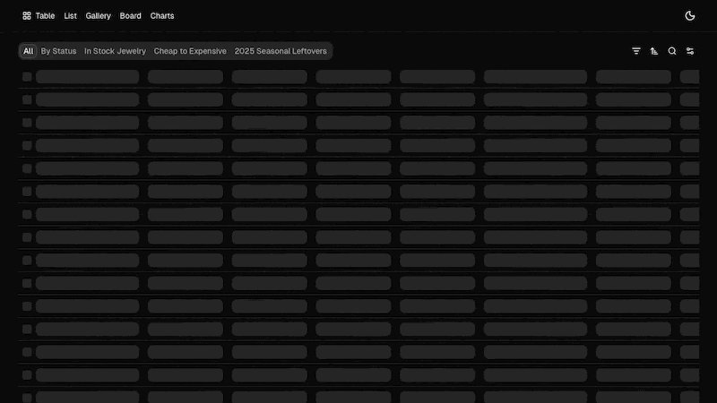
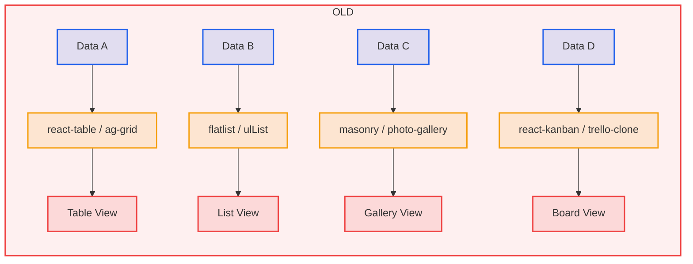
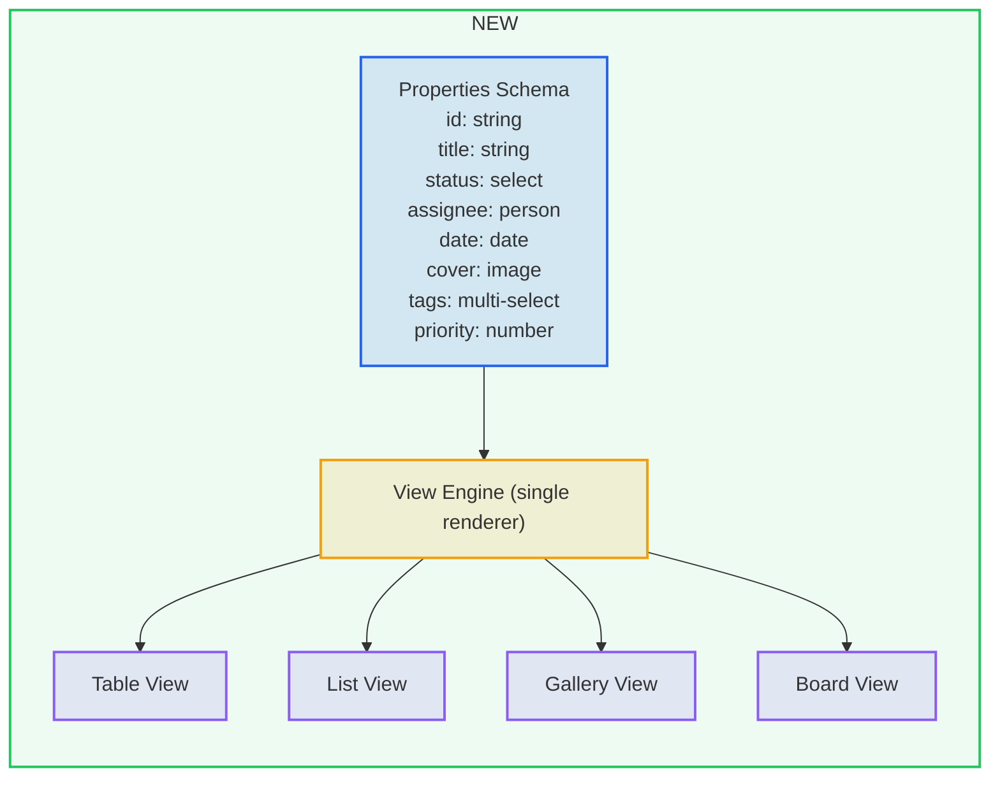

# [Ocean DataView](https://ocean-dataview.sparkyidea.com)

Notion-style data views for React: table, list, gallery, board, and charts with filtering, sorting, grouping, and URL-synced state.

[](https://ocean-dataview.sparkyidea.com)

[](./LICENSE)
[](https://github.com/jingerpie/ocean-dataview/actions/workflows/ci.yml)

## Why I Built This

Traditional approach (fragmented):



Notion's elegant approach to data visualization inspired this unified model:



## Tech Stack

- **Framework:** [Next.js](https://nextjs.org)
- **Styling:** [Tailwind CSS](https://tailwindcss.com)
- **UI Components:** [shadcn/ui](https://ui.shadcn.com)
- **State Management:** [nuqs](https://nuqs.47ng.com) (URL state)
- **Data Fetching:** [TanStack Query](https://tanstack.com/query) + [tRPC](https://trpc.io)
- **API Server:** [Hono](https://hono.dev)
- **Database:** [PostgreSQL](https://www.postgresql.org)
- **ORM:** [Drizzle ORM](https://orm.drizzle.team)

## Features

- [x] Multiple view types: `TableView`, `ListView`, `GalleryView`, `BoardView`
- [x] Chart views: vertical bar, horizontal bar, line, area, donut
- [x] Notion-style toolbar with filters, sort, search, group, visibility
- [x] Rich property system (text, number, select, multi-select, status, date, media, checkbox, url, email, phone, formula, button)
- [x] Server-side pagination, sorting, filtering, and grouping
- [x] Pagination modes: page, load-more, infinite scroll
- [x] URL-driven state with shareable links
- [x] Per-column/group pagination for board view

## Running Locally

### Prerequisites

- Bun `>= 1.3.9`
- Node.js `>= 20`
- PostgreSQL `>= 15`

### Setup

1. **Clone the repository**

   ```bash
   git clone https://github.com/jingerpie/ocean-dataview
   cd ocean-dataview
   ```

2. **Install dependencies**

   ```bash
   bun install
   ```

3. **Set up environment variables**

   ```bash
   cp apps/server/.env.example apps/server/.env
   cp apps/web/.env.example apps/web/.env.local
   ```

   Update with your database credentials:
   - `apps/server/.env`: Set `DATABASE_URL` and `CORS_ORIGIN=http://localhost:3001`
   - `apps/web/.env.local`: Set `NEXT_PUBLIC_SERVER_URL=http://localhost:3000`

4. **Set up database**

   ```bash
   bun run db:push   # Push schema
   bun run db:seed   # Seed demo data
   ```

5. **Start development servers**

   ```bash
   bun run dev
   ```

   - Web: [http://localhost:3001](http://localhost:3001)
   - API: [http://localhost:3000](http://localhost:3000)

## Roadmap

- [ ] Documentation site (in progress)
- [ ] shadcn CLI integration
- [ ] Resizable table columns
- [ ] Chart (in progress)
- [ ] Timeline view
- [ ] Feed view
- [ ] Map view
- [ ] Calendar view
- [ ] Form view

## Contributing

See [CONTRIBUTING.md](./CONTRIBUTING.md) and [AGENTS.md](./AGENTS.md).

## Credits

- [shadcn/ui](https://github.com/shadcn-ui/ui) - For the beautiful UI components
- [tablecn](https://github.com/sadmann7/tablecn) - For README structure and project inspiration

## License

MIT - see [LICENSE](./LICENSE).
